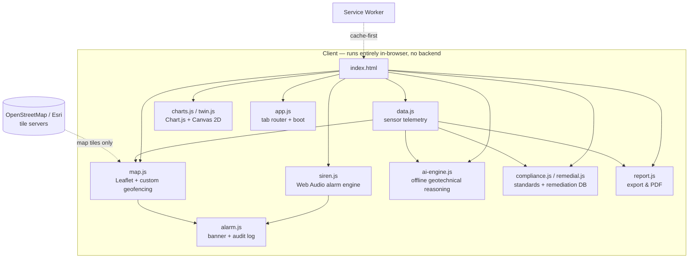

<div align="center">

# 🛰️ GeoSentinel Pro

### International-Standard Soil Bearing Capacity & Foundation Integrity Monitoring Platform

[](LICENSE)
[](https://pages.github.com/)
[](#getting-started)
[](#offline--installable-pwa)
[](#standards-compliance)
[](#standards-compliance)
[](#standards-compliance)

A real-time, fully client-side dashboard for monitoring soil bearing capacity and foundation
integrity, with GIS geofencing, an offline geotechnical AI engine, an audible alarm system, and
a live compliance matrix against six international geotechnical and safety standards.

**No backend. No API keys. No build step.** Open `index.html` and it runs — or deploy it to
GitHub Pages in under two minutes.

[Live Demo](#deploying-to-github-pages) · [Features](#features) · [Architecture](#architecture) · [Getting Started](#getting-started)

</div>

---

## Overview

GeoSentinel Pro was built to answer a simple question for a geotechnical site operator:
**"Is the ground still safe to build on, right now, and what should I do about it if it isn't?"**

It combines live (simulated) sensor telemetry, an interactive GIS map with custom-drawn
surveillance geofences, a from-scratch geotechnical reasoning engine, and an audible siren
alarm system — all running entirely in the browser, with zero external API dependency for its
core intelligence.

The reference deployment monitors a 9-node sensor array across a site in Baripada, Odisha,
India (21.1997°N, 86.1201°E), but every data point is a plain JavaScript object in
[`js/data.js`](js/data.js) — swap in your own telemetry feed and the rest of the platform
works unchanged.

## Features

### 📊 Dashboard
Live KPI cards (bearing capacity, settlement, moisture, vibration, factor of safety, pore
pressure, SIL level, data quality index), a 24-hour bearing capacity trend chart with AI
forecast overlay, a 12-zone integrity heatmap, and a rolling predictive risk index.

### 📡 Sensors
Full telemetry table across 9 nodes with bearing capacity, settlement, moisture, temperature,
pore pressure, factor of safety, and live protocol tags (MQTT / Modbus / OPC-UA). Includes a
calibration & drift-tracking schedule referencing IS 1888:1982 and ISO 22476.

### 📈 Analytics
Zone-by-zone bearing capacity (Terzaghi/Meyerhof), 30-day AI failure-probability forecasts,
depth-vs-capacity soil profiling with SPT correlation, and settlement-vs-limit tracking.

### 🗺️ Map & Geofencing
An interactive Leaflet map with street/satellite layers. Operators draw **polygon, rectangle,
or circle** surveillance geofences directly on the map — the engine instantly checks which
sensors fall inside each zone and fires an alarm automatically if a critical or warning sensor
is enclosed. Built on Leaflet's native event API rather than a drawing plugin, so there's no
async-load race condition to fight.

### 🧊 Digital Twin
A live canvas-rendered 2D cross-section of the foundation: soil layers, per-zone bearing
capacity bars, sensor nodes plotted at true installation depth, and a ranked failure-mode
analysis (general shear, punching shear, progressive settlement, liquefaction, slope
instability).

### 🤖 AI Assistant — fully offline
A from-scratch geotechnical reasoning engine (`js/ai-engine.js`) with intent detection across
25+ query types and a knowledge base spanning Terzaghi/Meyerhof/Hansen bearing theory,
IS 6403/1904/1892/2911/15284/13827, Eurocode 7 (EN 1997-1 DA1 partial-factor method), ASCE
7-22, and IEC 61511. Every answer is computed live from the current sensor state — nothing is
hard-coded, and **no external API or network call is ever made.**

### ✅ Compliance
A live pass/partial/fail matrix against IS 6403:1981, IS 1904:1986, Eurocode 7 (EN 1997),
ISO 22476, IEC 61511 SIL 2, and ISO 9001:2015 — plus an IoT protocol connectivity table
(MQTT v5 / Modbus RTU / OPC-UA / LoRaWAN).

### 🚨 Remedial Measures
A structured "cloud geotechnical database" that maps each sensor's actual failure mode
(low bearing capacity / high moisture / excessive settlement / warning-level) to specific,
numbered remedial steps — compaction grouting, vibro-replacement stone columns, sub-drain
installation, micro-pile underpinning — each citing its governing standard.

### 🔔 Alerts & Siren Alarm
A persistent alarm banner with a **Web Audio API siren** — zero audio files, zero
dependencies. Critical alerts play a two-tone sawtooth "wee-woo" siren; warnings play a
descending sine pulse. Both loop until silenced or dismissed, and an audit trail timestamps
every alarm, operator action, and AI query.

### 📄 Report & Export
One-click auto-generated site assessment report (executive summary, critical findings,
compliance status, immediate actions), plus JSON and CSV data export and print-to-PDF.

---

## Architecture



Everything except map tiles is served as static files — the entire application (dashboard,
AI reasoning, alarm system, compliance engine) works **fully offline** once loaded, courtesy
of the service worker cache-first strategy.

## Tech Stack

| Layer | Technology |
|---|---|
| Markup / structure | Semantic HTML5, no framework |
| Styling | Vanilla CSS3 with custom properties (light/dark mode via `prefers-color-scheme`) |
| Charts | [Chart.js 4](https://www.chartjs.org/) (CDN) |
| Mapping | [Leaflet 1.9](https://leafletjs.com/) (CDN) + a hand-built geofencing engine |
| Digital twin | Native Canvas 2D API |
| Audio | Web Audio API (no audio files) |
| AI reasoning | Pure JavaScript intent-matching + template engine — no LLM, no API |
| PWA | Web App Manifest + Service Worker (cache-first) |
| Testing | Node.js + jsdom smoke test (see [`tests/`](tests/)) |
| Hosting | Static — deploys anywhere, including GitHub Pages |

## Project Structure

```
geosentinel-pro/
├── index.html                  # App shell — all sections, loads modules in order
├── manifest.json                # PWA manifest
├── service-worker.js            # Offline cache-first strategy
├── package.json                 # Dev-only: test script + metadata
├── css/
│   └── styles.css               # All styling (light + dark mode)
├── js/
│   ├── data.js                  # Sensor telemetry, alerts, maintenance, remedial DB
│   ├── siren.js                 # Web Audio API siren engine
│   ├── alarm.js                 # Alarm banner + audit trail
│   ├── dashboard.js              # Dashboard/sensor/analytics panel renderers
│   ├── charts.js                 # Chart.js visualisations
│   ├── twin.js                   # Digital twin canvas renderer
│   ├── compliance.js             # Standards compliance matrix
│   ├── remedial.js               # Remedial measures panel
│   ├── report.js                 # Report generation + JSON/CSV export
│   ├── map.js                    # Leaflet map + custom geofencing engine
│   ├── ai-engine.js              # Offline geotechnical AI (GeoAI)
│   └── app.js                    # Tab router + boot sequence
├── assets/
│   ├── favicon.svg
│   ├── icon-192.png
│   └── icon-512.png
├── tests/
│   └── smoke-test.js             # jsdom runtime test — loads every module, exercises every tab
└── .github/workflows/
    └── deploy.yml                # Auto-deploy to GitHub Pages on push to main
```

## Getting Started

No build tools, no `npm install` required to run the app itself.

```bash
git clone https://github.com/YOUR_USERNAME/geosentinel-pro.git
cd geosentinel-pro

# Any static file server works:
python3 -m http.server 8080
# or
npx serve .
```

Then open `http://localhost:8080`. That's it.

> Opening `index.html` directly via `file://` also works for everything except the Leaflet
> map tiles, which most browsers block from a `file://` origin — serve over `http://` for the
> full experience.

### Running the test suite

The optional smoke test loads every module into a real DOM (via jsdom) and exercises the full
boot sequence, all ten tabs, the AI chat, and both export functions:

```bash
npm install      # installs jsdom, dev-only
npm test
```

## Deploying to GitHub Pages

**Option A — one-click via included GitHub Action (recommended)**

1. Push this repository to GitHub.
2. Go to **Settings → Pages → Source** and select **GitHub Actions**.
3. Push to `main` — the included [`.github/workflows/deploy.yml`](.github/workflows/deploy.yml)
   builds and deploys automatically. Your site will be live at:
   `https://YOUR_USERNAME.github.io/geosentinel-pro/`

**Option B — classic branch deployment**

1. Push this repository to GitHub.
2. Go to **Settings → Pages → Source** and select **Deploy from a branch** → `main` → `/ (root)`.
3. Save. Your site is live at the same URL within a minute or two.

### Publishing from the command line

```bash
cd geosentinel-pro
git init
git add .
git commit -m "Initial commit — GeoSentinel Pro v3.0"
git branch -M main
git remote add origin https://github.com/YOUR_USERNAME/geosentinel-pro.git
git push -u origin main
```

Then enable Pages as described above.

## Offline / Installable PWA

GeoSentinel Pro ships with a Web App Manifest and a cache-first Service Worker. Once loaded
once, the full dashboard — including the AI engine, alarm system, and compliance matrix —
works with no network connection. Only the map tile imagery requires connectivity. On mobile
or desktop Chrome/Edge, use **"Install app"** from the browser menu to add it as a standalone
application.

## Standards Compliance

The reference dataset intentionally includes one non-compliant sensor (Zone C) to demonstrate
the platform's full alerting, geofencing, and remediation workflow end-to-end. The Compliance
tab evaluates the live data against:

| Standard | Scope |
|---|---|
| IS 6403:1981 | Net safe bearing capacity, factor of safety |
| IS 1904:1986 | Foundation design, settlement limits |
| IS 1892:1979 | Subsurface investigation |
| IS 2911:2010 | Pile foundations |
| IS 15284:2003 | Ground improvement |
| IS 1888:1982 | Plate load test method |
| IS 13827:1993 | Improving earthquake resistance |
| EN 1997-1:2004 (Eurocode 7) | Geotechnical design, DA1 partial-factor method |
| ASCE 7-22 Ch.18 | Foundation loads |
| ASTM D1586 | Standard Penetration Test |
| IEC 61511 | Functional safety, SIL rating |
| ISO 22476 | Geotechnical investigation & testing |
| ISO 9001:2015 | Quality management |

## Customizing for Your Own Site

1. Replace the `SENSORS` array in [`js/data.js`](js/data.js) with your own sensor IDs,
   coordinates, and readings (wire it up to a real MQTT/Modbus feed if desired).
2. Update the site center coordinates in [`js/map.js`](js/map.js) (`initMap()`) and in
   `index.html`'s default lat/lng inputs.
3. Adjust alarm thresholds in the Map & Geofencing tab, or hard-code new defaults in
   [`js/alarm.js`](js/alarm.js).
4. Extend [`js/data.js`](js/data.js)'s `REMEDIAL_DB` and [`js/ai-engine.js`](js/ai-engine.js)'s
   response templates with any additional standards relevant to your jurisdiction.

## Roadmap

- [ ] WebSocket/MQTT live-data adapter (swap the mock `SENSORS` array for a real feed)
- [ ] Multi-site support with a site-selector
- [ ] Historical time-series storage (IndexedDB) for true trend analysis
- [ ] SMS/email alert integration
- [ ] Exportable PDF report styling pass

## Contributing

Issues and pull requests are welcome. Please run `npm test` before submitting a PR.

## License

Released under the [MIT License](LICENSE).

## Acknowledgments

Built with [Leaflet](https://leafletjs.com/), [Chart.js](https://www.chartjs.org/),
[OpenStreetMap](https://www.openstreetmap.org/copyright) contributors, and Esri World
Imagery.

---

<div align="center">
<sub>GeoSentinel Pro is a demonstration platform. Sensor data is simulated. Consult a
licensed geotechnical engineer before making any real-world foundation or site-safety
decisions.</sub>
</div>
